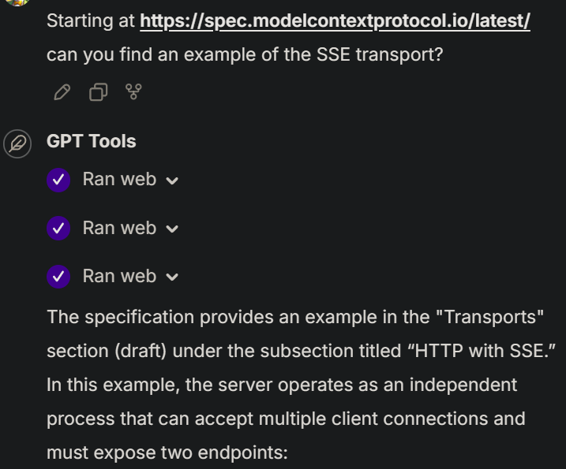

# Web Tool

1. [What can it do?](#what-can-it-do)
2. [Processing Modes](#processing-modes)
   1. [Markdown Mode (default)](#markdown-mode-default)
   2. [Links Mode](#links-mode)
   3. [Raw Mode](#raw-mode)
3. [Features and Limits](#features-and-limits)
   1. [Content Management](#content-management)
   2. [Safety Features](#safety-features)

A tool that lets AI assistants access and process web content safely. It can convert pages to
markdown, extract links, or get raw content - helping the AI give you more accurate, up-to-date
information.



## What can it do?

When you're discussing documentation, researching solutions, or need current information, the AI
can access web content to help. It's particularly useful when you want to:

- Get the latest documentation for a library or tool
- Find code examples that match your specific needs
- Navigate through complex documentation structures
- Verify that advice is current and accurate

The tool handles all the technical details like following redirects, handling errors, and cleaning
up messy HTML. You just point the AI at a URL, and it'll bring back the information in a format
that's easy to work with.

## Processing Modes

The AI can process web content in three different ways, each designed for specific needs:

### Markdown Mode (default)

Most of the time, you'll want clean, readable content without the clutter of web formatting.
Markdown mode automatically removes adverts, navigation menus, and other distractions, focusing on
the actual content you care about. It preserves important elements like headings, lists, tables,
and images, converting them into clean markdown that's easy to read.

If something goes wrong with the conversion, the tool automatically falls back to raw content,
letting the AI still help you even if the page is unusually formatted.

Example output:

```markdown
Contents of https://example.com/article:

# Main Heading

Article content in clean markdown format...

## Subheadings preserved

* Lists kept intact
* With proper formatting


| Tables | Converted |
|--------|-----------|
| To     | Markdown  |
```

### Links Mode

When you're exploring documentation or need to navigate through a website, links mode helps map
out the available paths. It finds all the links on a page, converts them to absolute URLs so they
always work, and shows you the text used to describe each link. This is particularly helpful when
you need to:

- Navigate through multi-page documentation
- Find related articles or resources
- Locate specific sections in large documents
- Build a map of available information

The AI orders links by relevance, filters out noise like social media buttons, and gives you a
clean list of where you can go next.

Example output:

```markdown
All 45 links found on https://example.com

- Home: https://example.com/
- Products: https://example.com/products
- About Us: https://example.com/about
...
```

### Raw Mode

Sometimes you need the original, unprocessed content - particularly when working with APIs,
downloading code, or accessing structured data. Raw mode gives you exactly what the server sends,
while still handling things like authentication, redirects, and error handling behind the scenes.

## Features and Limits

The tool includes several features to make web access both powerful and safe:

### Content Management

The AI can handle content of any size, but you can control how much it processes at once. Setting
a length limit helps when you're working with large documents or want to focus on specific
sections. You'll always get complete sentences and properly formatted content, with clear warnings
if anything gets truncated.

If something goes wrong - whether it's a network issue, an authentication problem, or just an
unusually formatted page - you'll get clear, actionable error messages explaining what happened
and often suggesting how to fix it.

### Safety Features

Behind the scenes, the tool uses industrial-strength libraries like `trafilatura` and
`BeautifulSoup` to handle web content safely. It carefully processes URLs, headers, and content to
prevent common issues, while giving you the flexibility to access the resources you need.

The tool strikes a careful balance - giving AI assistants broad access to web content while
maintaining security and providing clear feedback. This means you can confidently point the AI at
documentation or resources, knowing it'll handle the technical details and bring back exactly what
you need.
